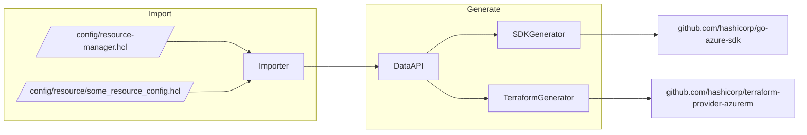

# Pandora Overview

Prior to reading this, we [recommend reading the top-level README file which contains a summary of the project](../README.md).

## High Level Diagram

More details can be found [in the main README under "how does this work"](https://github.com/hashicorp/pandora#how-does-this-work).

## Overview

Pandora is a suite of tools for converting the Azure API Definitions (from [`Azure/azure-rest-api-specs`](https://github.com/Azure/azure-rest-api-specs)) into both a Go SDK (output as [`hashicorp/go-azure-sdk`](https://github.com/hashicorp/go-azure-sdk)) and Terraform Resources within [the AzureRM Provider](https://github.com/hashicorp/terraform-provider-azurerm).

Each tool [is described in the main README file](https://github.com/hashicorp/pandora) - however each is involved in the process and is primarily intended to be run in automation (via GitHub Actions) however can also be run locally.

Specific information on each tool can be found in the README for each tool, [for example the `importer-rest-api-specs` tool](https://github.com/hashicorp/pandora/tree/main/tools/importer-rest-api-specs).

## How can I import and generate a Go SDK for a given Service/API Version?

[See this document](resource-manager-service-import.md) on how to import a new Service/API Version into Pandora's Data Format - once a PR has been sent/merged this is automatically released [into `hashicorp/go-azure-sdk`](https://github.com/hashicorp/go-azure-sdk).

## How can I generate a new Resource?

First, the Service and API Version being used must be imported and the Go SDK generated into `hashicorp/go-azure-sdk` (see the section above).

Once that's available, [this guide](resource-manager-generate-new-resource.md) explains how to add a new resource and some known limitations at this point in time.

## Resource ID's as a primary concept

Resource ID's within Azure are unique URIs defining a resource, such as a Resource Group or Virtual Machine which have a known format.

Since Resource ID's are both integral to the Azure API and Terraform, Pandora leans on these as a primary concept - for example exposing a Struct for each Resource ID in the Go SDK ([example](https://github.com/hashicorp/go-azure-sdk/blob/02bf8d8d30faa69d2a9f347e33a751e9d4342b56/resource-manager/compute/2022-03-02/disks/id_disk.go#L12-L29)) which is then used as an argument for each HTTP Operation ([example](https://github.com/hashicorp/go-azure-sdk/blob/02bf8d8d30faa69d2a9f347e33a751e9d4342b56/resource-manager/compute/2022-03-02/disks/method_get_autorest.go#L20)).

When identifying candidate Terraform Resources as a part of the import process, Pandora's `importer-rest-api-specs` tool looks for Create (PUT), Read (GET) and Delete (DELETE) HTTP Operations against a given Resource ID (and also an Update [PATCH] if available).

As such Resource IDs are treated as a first class concept across Pandora, and (as described in the next section) are normalized where required for consistency.

## How does this differ from autorest?

Autorest is a toolchain that provides a broad spectrum of RESTful SDKs for various languages (see [here](https://github.com/Azure/autorest/blob/main/docs/introduction.md) for details). The Autorest process involves a relatively complicated transformation process that aims to provide SDKs that have the same "look and feel" between languages and often collects together multiple API versions into a single SDK version, meaning that resources in a single SDK version _may_ use differing API versions in their RESTful calls. This approach has obvious upsides for developers, but also means that specific use cases of SDK usage may not be ideal.

Pandora also consumes the OpenAPI data (aka Swagger), however, it does not perform this collection of disparate versions, mandating instead to be explicit in the API version in use at all times. Pandora's first-class citizen for SDK generation is Terraform, and the only output language is Go. This difference means that the resultant generated SDKs are compatible with Terraform's requirements, and the generation process can, and will, be kept in-line with that compatibilty over time.

## Data Normalization

When Pandora's `rest-api-specs-importer` tool runs, data from the Azure API Definitions is first parsed and then run through a normalization process, prior to being output in the data format used by the Data API Definitions.

The normalization applies both to Resource ID Segments (which allows us to workaround where a URI maybe defined twice in the Azure API Definitions with different casings) and the Fields themselves (turning these from types which are unique per Service/API to "common schema", with common behaviours).

This approach allows the generated Resources to be behaviourally consistent with existing Resources within the AzureRM Provider (for example with `identity` block being exposed the same way regardless of the API behaviour which differs per API - or the `location` field which always gets normalized).

## Use of Meta Clients

The Go SDK generated by this repository outputs a Meta Client, which contains a reference to all of the SDK Clients available for a given API Version for a given Service.

Rather than defining an SDK Client for each Service, the Terraform Resources generated by Pandora's Terraform Generator output make use of these Meta Clients for each Service.

For entirely generated Services, this means that an SDK Client will be generated and configured automatically - however when adding generated Resources to an existing Service, some minor refactoring must be done to prepare for the generated SDK Client.

These changes can be found [in this Pull Request](https://github.com/hashicorp/terraform-provider-azurerm/pull/18633/files#diff-c47c90c4f797ec0d7d497ca95d39073297ddc58f40fb188b6b7ce81e981d4baaR6-R17) - however a more detailed/step-by-step guide will follow here in the future.
